# In Search of the Modern Lightweight Linux Champion
Deep Grewal - April 19, 2021

---

As a Linux user, I was recently in search of a Linux distribution (distro) that is lightweight and runs efficiently on a virtual machine or a physical machine using minimal resources.  In the end, only 1 would be chosen as the lightweight Linux distribution of choice.  It would have to be good enough to deploy as a daily-driver on my main machine.  So, I began the online search and found many articles recommending copious distros which claim to check the boxes for the aforementioned requirements.  Needless to say, the number of returned results was staggering.     

## The Long List of Contenders
The distros which were recommended most commonly have been compiled into a list of contenders as shown below.  Whenever possible, the most recent stable release of each distro was chosen.  The values provided for the "RAM" and "Disk Space" columns are the preferred/recommended system requirement values (not the minimum system requirement values).  

Distro | Based On | Version | Last Release | Release Model | Packages | Desktop | Init | Kernel | ISO Size | RAM | Disk Space
-------|----------|---------|--------------|---------------|----------|---------|------|--------|----------|-----|-----------
Absolute | Slackware | 20210327 | 03/27/2021 | Fixed | TXZ | IceWM | SysV | 5.10.26 | 2300 MB | ? | ?
Antix | Debian | 19.3 | 01/03/2021 | Fixed/Semi-Rolling | DEB/APT | IceWM | sunit/SysV | 4.9.240 | 1100 MB | 256 MB | 5 GB
Bodhi | Ubuntu | 5.1.0 | 03/23/2020 | Fixed | DEB/APT | Moksha | systemd | 4.15.0 | 802 MB | 768 MB | 10 GB
BunsenLabs | Debian | 2.1 lithium | 08/02/2020 | Fixed | APT | Openbox | systemd | 4.19.118 | 1200 MB | 2048 MB | 20 GB
Elive | Debian | 3.8.18 | 01/06/2021 | Fixed | DEB/APT | Enlightenment | systemd | 4.19.160 | 3100 MB | 192 MB| ?
Linux Lite | Ubuntu | 5.4 | 04/01/2021 | Fixed | DEB/APT | Xfce | systemd | 5.4.0 | 1400 MB | 1024 MB | 20 GB
Lubuntu | Ubuntu | 20.10 | 10/22/2020 | Fixed | DEB/APT | LXQt | systemd | 5.8.0 | 1800 MB | 1024 MB | 6 GB
LXLE | Lubuntu | 18.04.3 | 09/09/2019 | Fixed | DEB/APT | LXDE | systemd | 4.15.0 | 1200 MB | 1024 MB | 8 GB
Porteus | Slackware | 4.0 | 04/30/2018 | Fixed | XZ | Cinnamon/KDE/LXQt/LXDE/MATE/Openbox/XFCE | SysV | 4.16.3 | 300 MB | 512 MB | ?
Puppy | Ubuntu/Slackware | 9.5 fossapup | 09/17/2020 | Fixed | PET | JWM | SysV | 5.4.53 | 409 MB | 256 MB | 1 GB
Q4OS | Debian | 3.14 | 02/16/2021 | Fixed | DEB/APT | KDE/Trinity | systemd | 4.19.171 | 922 MB | 1024 MB | 5 GB
Slax | Debian | 9.11.0 | 09/14/2019 | Fixed | DEB/APT | Fluxbox | systemd | 4.9.189 | 265 MB | 512 MB | ?
SliTaz | Independent | 5.0 | 11/18/2018 | Rolling | TazPKG | Openbox | other | 3.16.55 | 65 MB | 256 MB | 80 MB
Sparky | Debian | 5.14 | 02/05/2021 | Fixed, Semi-Rolling | DEB/APT | LXQt/MATE/Xfce/KDE | systemd | 4.19.171 | 1600 MB | 384 MB | 30 GB
Tiny Core | DSL | 12.0 | 02/17/2021 | Fixed | TCE | flwm | BusyBox | 5.10.3 | 106 MB | 128 MB | ?
Trisquel Mini | Ubuntu | 9.0 Etiona | 10/19/2020 | Fixed | DEB/APT | LXDE | systemd | 4.15.0 | 1200 MB | 256 MB | 5 GB
Ubuntu MATE | Ubuntu | 20.10 | 10/22/2020 | Fixed | DEB/APT | MATE | systemd | 5.8.0 | 2500 MB | 4096 MB | 16 GB
Xubuntu | Ubuntu | 20.10 | 10/22/2020 | Fixed | DEB/APT | Xfce | systemd | 5.8.0 | 1700 MB | 2048 MB | 20 GB
Zorin OS Lite | Ubuntu | 15.3 | 09/08/2020 | Fixed | DEB/APT | Xfce | systemd | 5.4.0 | 2200 MB | 512 MB | 8 GB

&nbsp;  
## Criteria
With a list this long, it is difficult and impractical to download the ISO and perform a test run for each and every distro.  Some qualifying criteria would definitely help in pairing down this list.  For my own needs, I wanted a distro that is: (1) modern and (2) updated regularly.  

Let's start by defining "modern".  It can be a very vague term and interpreted as meaning different things.  A "modern" distro, as defined for this experiment, is one that has adopted systemd and has a kernel version that is greater than or equal or to the last 2 major LTS kernels (5.10 and 5.4).    

Simply being "modern" isn't quite enough.  I don't want to end up with a distro that is a one-hit wonder or has a short run.  So, a track record of routine and regular updates is preferred since it builds more confidence in sticking with the distro for a longer period of time.  I didn't want to run into a short-lived distro and repeat my past experience with Antergos.  

## The Shortened List of Contenders
After applying the criteria above to the list of contenders, the list was refined as follows.  Not surprisingly, all of the qualifying distros are based on Ubuntu (although this was not the intention). However, it does highlight the lack of modern distros that are lightweight and based on something other than Ubuntu.  

Distro | Based On | Version | Last Release | Release Model | Packages | Desktop | Init | Kernel | ISO Size | RAM | Disk Space
-------|----------|---------|--------------|---------------|----------|---------|------|--------|----------|-----|-----------
Linux Lite | Ubuntu | 5.4 | 04/01/2021 | Fixed | DEB/APT | Xfce | systemd | 5.4.0 | 1400 MB | 1024 MB | 20 GB
Lubuntu | Ubuntu | 20.10 | 10/22/2020 | Fixed | DEB/APT | LXQt | systemd | 5.8.0 | 1800 MB | 1024 MB | 6 GB
Ubuntu MATE | Ubuntu | 20.10 | 10/22/2020 | Fixed | DEB/APT | MATE | systemd | 5.8.0 | 2500 MB | 4096 MB | 16 GB
Xubuntu | Ubuntu | 20.10 | 10/22/2020 | Fixed | DEB/APT | Xfce | systemd | 5.8.0 | 1700 MB | 2048 MB | 20 GB
Zorin OS Lite | Ubuntu | 15.3 | 09/08/2020 | Fixed | DEB/APT | Xfce | systemd | 5.4.0 | 2200 MB | 512 MB | 8 GB

&nbsp;
## Methodology
The procedure for this experiment is quite simple.  Create a virtual machine with no operating system installed and take a snapshot.  Download the ISOs of each distribution. Install a distro to the virtual machine using the default settings whenever possible (avoiding the option to install additional drivers and media codecs).  Then, measure the results at an idle state of the running distro. Finally, revert the virtual machine back to the snapshot (no OS installed) and repeat for the next distro.

### Download the ISO Files
Thanks to some useful criteria, it is a lot easier to test 5 distros as compared to 20 distros.  I downloaded the latest ISO file directly from the respective website for each distro.  The sizes of the ISOs differed significantly (sorted below in descending file size order). 

Distro | File Name | File Size
-------|-----------|----------
Ubuntu Mate 20.10 | ubuntu-mate-20.10-desktop-amd64.iso | 2.6 GB
Zorin OS Lite 15.3 | Zorin-OS-15.3-Lite-64-bit.iso | 2.3 GB
Lubuntu 20.10 | lubuntu-20.10-desktop-amd64.iso | 1.8 GB
Xubuntu 20.10 | xubuntu-20.10-desktop-amd64.iso | 1.7 GB
Linux Lite 5.4 | linux-lite-5.4-64bit.iso | 1.4 GB

&nbsp;
### Create a Test Environment
Since I was testing for lightweight efficiency, a virtual machine seemed to be the best medium on which to test each distro.  Using virt-manager, I created a virtual machine which would be the installation target and testbench for each distro.  The specifications of the virtual machine are shown below.  The greatest RAM amount and greatest hard disk size were chosen from the recommended system requirements of the 5 distros to be tested to ensure that the greatest common factor (GCF) was considered.

Simply put, the virtual machine was created with the following set of attributes:

CPU | RAM | Hard Disk
----|-----|----------
2 | 4096 MB | 20 GB


&nbsp;
#### Virtual Machines Specs: Configuration File
For an exact set of specifications, here is the XML configuration of the virtual machine.

```xml
<domain type="kvm">
  <name>lwl</name>
  <uuid>fa517b06-9b81-47de-ad10-7f08f3ec28b9</uuid>
  <memory>4194304</memory>
  <currentMemory>4194304</currentMemory>
  <vcpu>2</vcpu>
  <os>
    <type arch="x86_64" machine="pc-i440fx-focal">hvm</type>
    <boot dev="hd"/>
  </os>
  <features>
    <acpi/>
    <apic/>
    <vmport state="off"/>
  </features>
  <cpu mode="host-model"/>
  <clock offset="utc">
    <timer name="rtc" tickpolicy="catchup"/>
    <timer name="pit" tickpolicy="delay"/>
    <timer name="hpet" present="no"/>
  </clock>
  <pm>
    <suspend-to-mem enabled="no"/>
    <suspend-to-disk enabled="no"/>
  </pm>
  <devices>
    <emulator>/usr/bin/qemu-system-x86_64</emulator>
    <disk type="file" device="disk">
      <driver name="qemu" type="qcow2"/>
      <source file="/mnt/virtuals/QEMU-KVM Boxes/vm1.qcow2"/>
      <target dev="vda" bus="virtio"/>
    </disk>
    <disk type="file" device="cdrom">
      <target dev="hdb" bus="ide"/>
      <readonly/>
    </disk>
    <controller type="usb" index="0" model="ich9-ehci1"/>
    <controller type="usb" index="0" model="ich9-uhci1">
      <master startport="0"/>
    </controller>
    <controller type="usb" index="0" model="ich9-uhci2">
      <master startport="2"/>
    </controller>
    <controller type="usb" index="0" model="ich9-uhci3">
      <master startport="4"/>
    </controller>
    <interface type="network">
      <source network="default"/>
      <mac address="52:54:00:87:e9:7d"/>
      <model type="e1000"/>
    </interface>
    <console type="pty"/>
    <channel type="spicevmc">
      <target type="virtio" name="com.redhat.spice.0"/>
    </channel>
    <input type="tablet" bus="usb"/>
    <graphics type="spice" port="-1" tlsPort="-1" autoport="yes">
      <image compression="off"/>
    </graphics>
    <sound model="ich6"/>
    <video>
      <model type="qxl"/>
    </video>
    <redirdev bus="usb" type="spicevmc"/>
    <redirdev bus="usb" type="spicevmc"/>
  </devices>
</domain>
```

With the test environment and methodology established, it was now time to put each distro to the test.  Here's how things went.

&nbsp;

---
&nbsp;


&nbsp;
## First Impressions
Linux Lite is a beautiful distro.  There are no visible rough edges and there is a lot of thought and consideration that has gone into the design, look, and feel of this distribution.  The welcome screen offers a good collection of options to help get you started and familiar with the distribution itself.  The software selection is well-curated and includes everything you need to get started with a fully-functional operating system.  The inclusion of  a partial LibreOffice Suite, Thunderbird, Firefox, VLC, and Timeshift are a nice touch.  The Control Panel/Settings is also great and provides for many of the critical settings and tweaks in one convenient location.  The distro prominently features desktop shortcuts to the Control Panel, This PC, User Files, Network, Trash, and the Help Manual.  The manual, launches a web-based navigation which has good documentation that is written for both the technical and non-technical.  Considering all of this, I would definitely recommend this distro to any newbie trying out Linux for the first time.  

&nbsp;
### The Welcome Screen
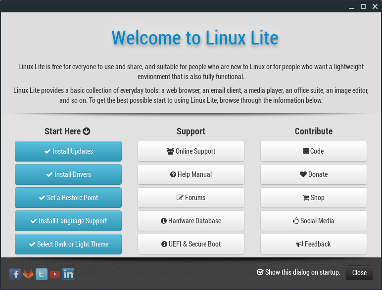

&nbsp;
### Control Panel/Settings
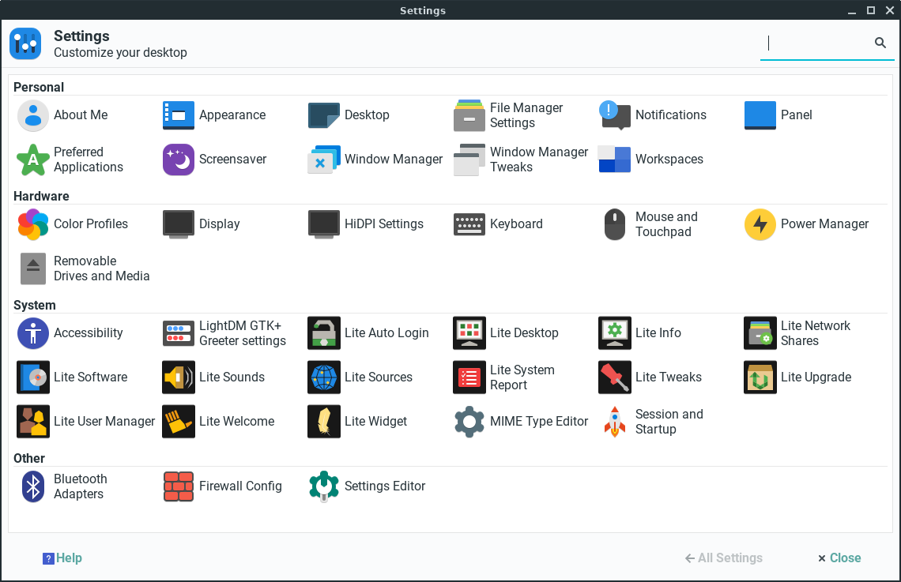

&nbsp;
## Resource Usage at Idle
With a name like "Linux Lite", one would expect that the resources usage for this distribution to be quite minimal.  Here's how it fared in terms of CPU and RAM usage at idle along with installation footprint size.

&nbsp;
### System Monitor
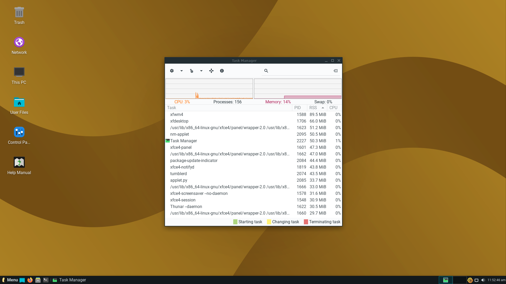

&nbsp;
### Disk Usage
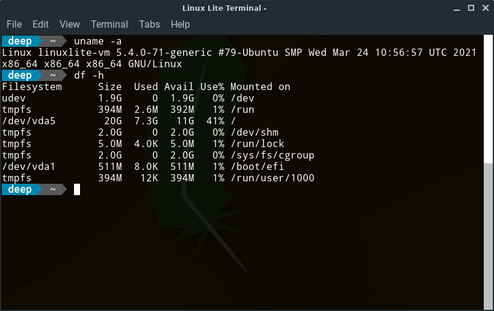

&nbsp;
### Usage Stats Summary
CPU | RAM | Hard Disk
----|-----|----------
3% | 573 MB (14%) | 7.3 GB (41%)

&nbsp;

---
&nbsp;


&nbsp;
## First Impressions
Lubuntu may not have the polish of Linux Lite, but it makes up for it with sheer simplicity and noticeable performance.  The LXQt desktop environment is snappy and quick to respond to user interactions.  The Configuration Center offers a good selection of settings and configurations that can be accessed from one location.  The default installation comes complete with the full LibreOffice Suite, Firefox, and VLC.  In an interesting move, Trojita is the default email client (and not Thunderbird).  There are a few unnecessary applications which also come preinstalled: K3B, Quassel IRC, and nobleNote.  I don't remember the last time I had to burn to an optical disc OR the last time I had to use IRC (in lieu of Telegram, Matrix, Discord, etc.) OR the last time a sticky note was created (maybe back in the Windows Vista days when experimenting with widgets).  Being a lightweight Linux distribution, the inclusion of these applications seems all the more contrary.  This distribution is perhaps best targeted at Linux users who have at least some basic experience with Linux. 

&nbsp;
### Configuration Center
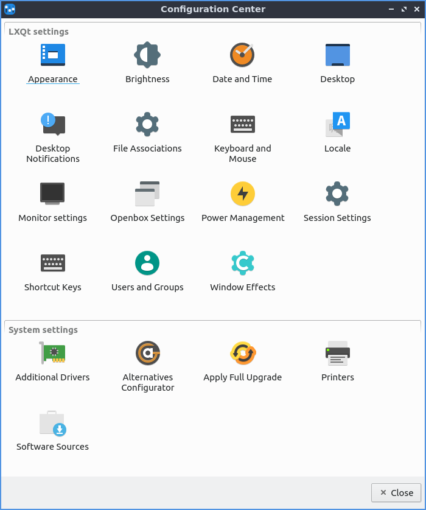

&nbsp;
### Unnecessary Applications
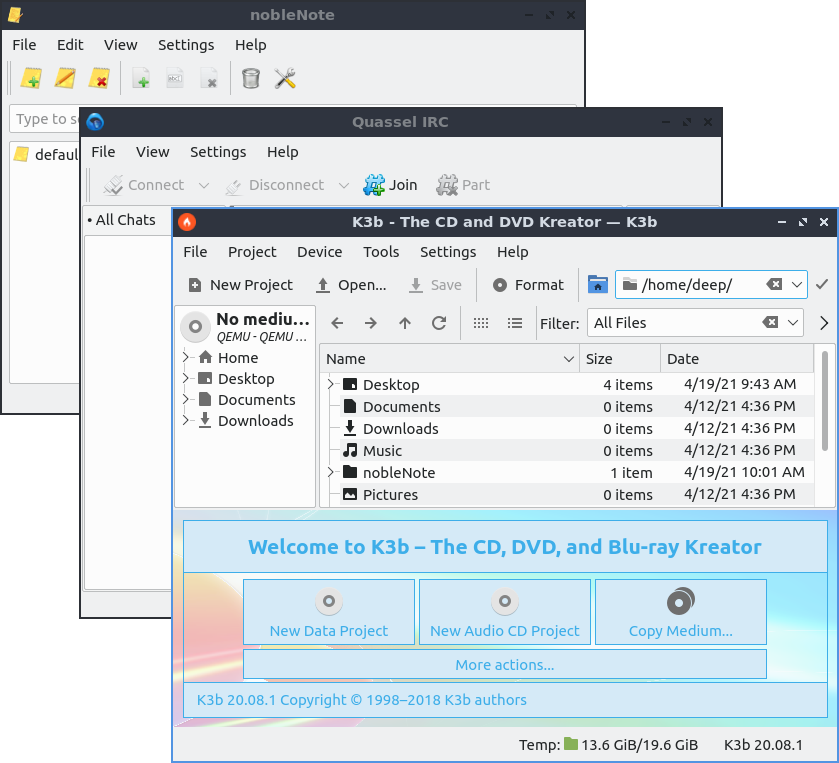

&nbsp;
## Resource Usage at Idle
Lubuntu absolutely shines when it comes to being light on resources.  It's hard to tell that this distribution is based on Ubuntu.  The LXQt desktop environment is a very lightweight and elegant choice for this distro.  The inclusion of superfluous applications has not impacted the disk install size of the operating system.  

&nbsp;
### System Monitor
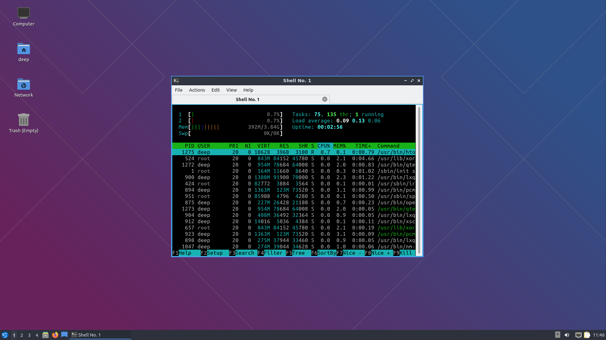

&nbsp;
### Disk Usage
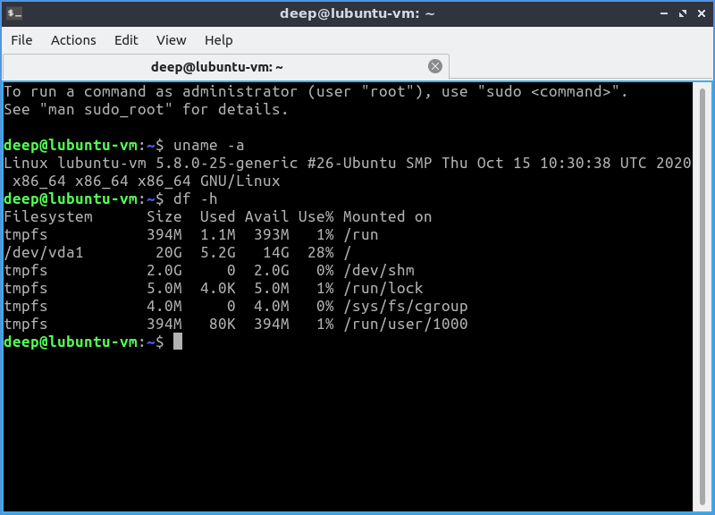

&nbsp;
### Usage Stats Summary
CPU | RAM | Hard Disk
----|-----|----------
1% | 392 MB (10%) | 5.2 GB (28%)

&nbsp;

---
&nbsp;


&nbsp;
## First Impressions
Ubuntu MATE is also another great distribution for those who are new to Linux.  Ubuntu MATE offers a Normal and Minimal installation.  For this experiment, the Normal installation was chosen since it offered LibreOffice, Evolution, utilities, and media players as part of the installation.  This makes the installation similar to the other 4 distros.  The user interface, menus, and settings are very well-designed.  The Control Center provides a central location for many of the distribution's configurations and settings.  The Software Boutique is the best application store I have ever seen for any distribution.  I went ahead and looked up my favorite game of all time, 0AD, and was impressed at how the Software Boutique displayed the information regarding this application.  Overall, using this distro feels good.  

&nbsp;
### Control Center
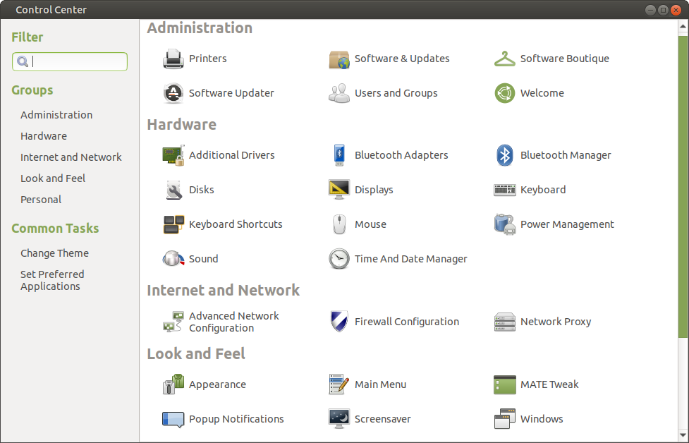

&nbsp;
### Software Boutique
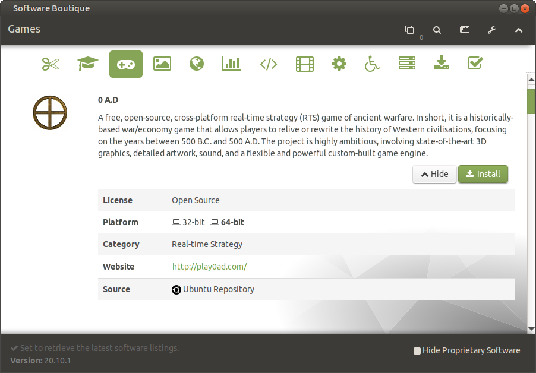

&nbsp;
## Resource Usage at Idle
From the looks of things, Ubuntu MATE doesn't seem to be competing in terms of being a lightweight desktop distribution.  Although it is definitely worthy of being a daily driver, it would be difficult to run this enjoyably on a machine with meager resource availability.

&nbsp;
### System Monitor
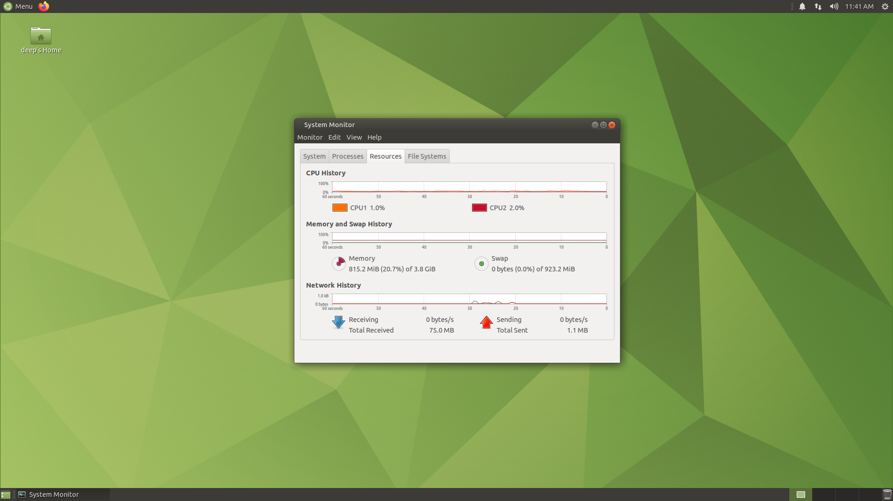

&nbsp;
### Disk Usage
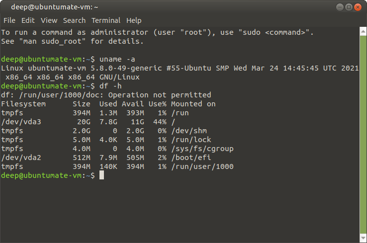

&nbsp;
### Usage Stats Summary
CPU | RAM | Hard Disk
----|-----|----------
2% | 815 MB (21%) | 7.8 GB (44%)

&nbsp;

---
&nbsp;


&nbsp;
## First Impressions
The one thing that jumps to mind is minimalism (at its finest).  If you want a desktop environment that stays out of your way, Xubuntu featuring Xfce is definitely a great fit.  The installation comes complete with the full LibreOffice suite, Thunderbird, and Firefox.  There are obviously other useful applications that also come pre-installed, in addition to some applications which seem to be irrelevant.  Similar to the criticism of Lubuntu, an optical disc burning application and a sticky notes application just don't seem that useful (although the latter perhaps has more utility).  The Settings Manager is a comprehensive collection of settings and configuration options, but isn't readily visible in the drop-down Whisker menu at first glance (it appears as an icon in the bottom right corner of the menu next to logging out and shutting down and also is available by right-clicking on the desktop and choosing Applications).  All-in-all, Xubuntu is snappy in performance while being a very attractive looking implementation of a GTK-based desktop environment.  

&nbsp;
### Settings
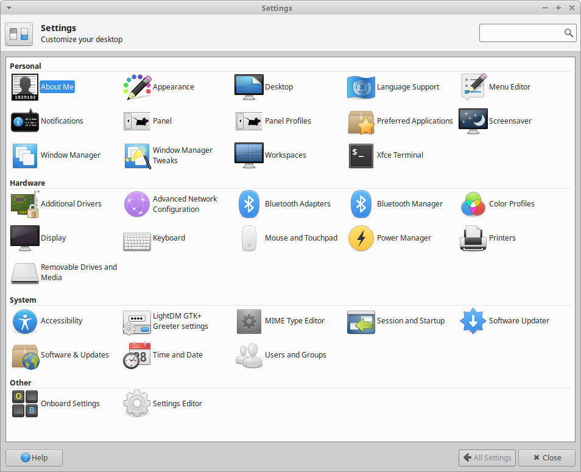

&nbsp;
### Unnecessary Applications
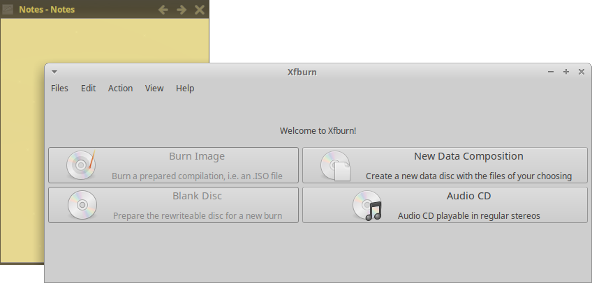

&nbsp;
## Resource Usage at Idle
Although Xfce is a lightweight desktop environment, it does not necessarily make Xubuntu very lean on resources.  The resource usage is simliar to that of Linux Lite (which also uses the Xfce desktop environment).

&nbsp;
### System Monitor
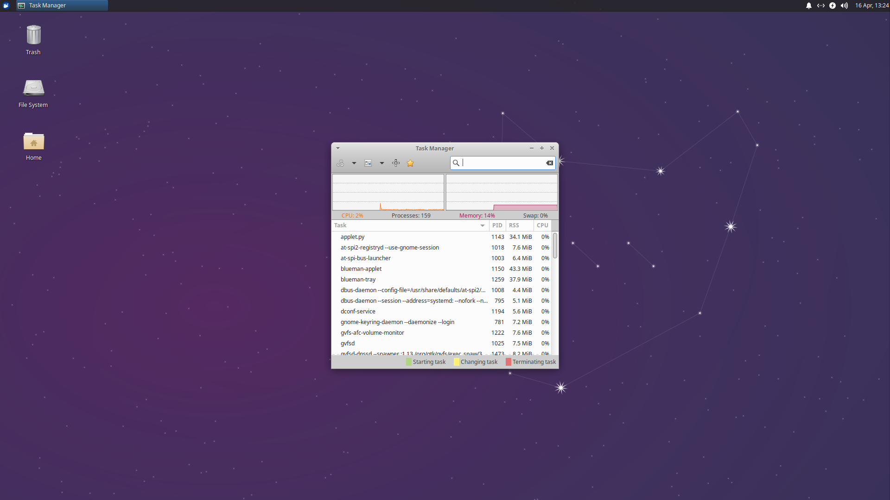

&nbsp;
### Disk Usage
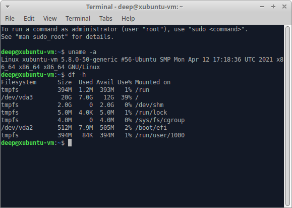

&nbsp;
### Usage Stats Summary
CPU | RAM | Hard Disk
----|-----|----------
2% | 573 MB (14%) | 7.0 GB (39%)

&nbsp;

---
&nbsp;


&nbsp;
## First Impressions
Zorin OS Lite looks good.  Actually, Zorin OS Lite looks great.  It stretches Xfce to new aesthetic limits.  It offers the most polished desktop experience when compared to any of the other 4 distros on this list.  I would argue that it is probably in the top tier of polished distros for any and all Linux distros out there (ranking right up there with deepin, elementary OS et al).  The full suite of LibreOffice is made available along with Thunderbird and Firefox.  I also noticed that Remmina is installed by default.  This might be for Windows users who are migrating to Zorin OS.  After all, Zorin OS does target this demographic of users.  The Pitivi video editor is also a default application.  I can see this being a good idea on the full version of Zorin OS, but it doesn't make too much sense for Zorin OS Lite which is meant to be installed on systems with less resources; video editing is a resource-intensive task.  And, once again, an optical disk burning application (Xfburn) is pre-installed.  I think it is safe to not include these types of applications by default.  There are many hardware manufacturers in the market which haven't even offer an optical disk drive for a few years now.

&nbsp;
### Settings
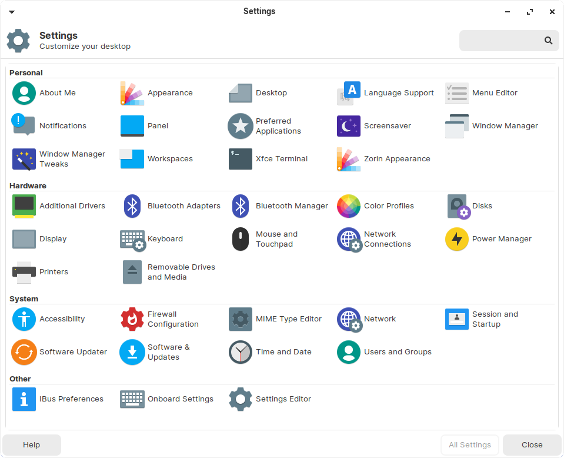

&nbsp;
### Unnecessary Applications
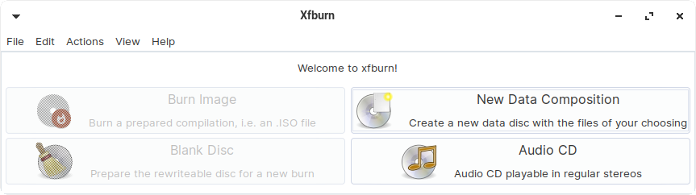

&nbsp;
## Resource Usage at Idle
Zorin OS Lite is essentially the heaviest Xfce-based distro in this analysis, especially when RAM usage is considered.  The installation footprint size is also on the higher end.  It may be relatively light in comparison to full-blown Zorin OS, but it's usage statistics do not look very flattering when compared to the other 4 distros who are also attempting to be meager on resources. 

&nbsp;
### System Monitor
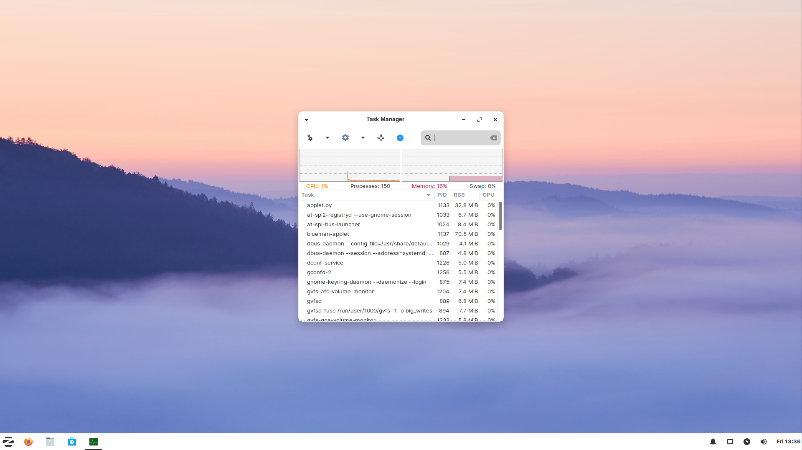

&nbsp;
### Disk Usage
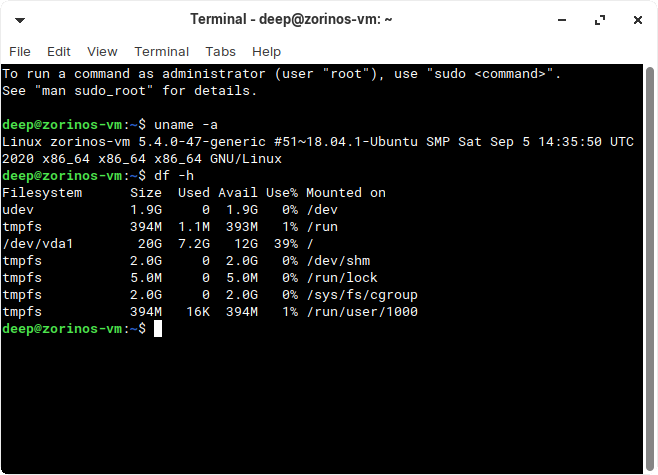

&nbsp;
### Usage Stats Summary
CPU | RAM | Hard Disk
----|-----|----------
1% | 655 MB (16%) | 7.2 GB (39%)

&nbsp;

---
## Conclusion
After installing each of these distros on a virtual machine and getting to know more about them (especially at an idle state), the following comparison is being made.  The difference of CPU usage at an idle state amongst the distros is negligible.  When we start to look at RAM utilization and hard disk space, the clear stand-out is Lubuntu.  The LXQt desktop really puts the Qt framework in a whole new light (pun alert) of being lean and efficient, especially in terms of memory usage at idle.  

&nbsp;
### Usage Stats Summary
Distro | CPU | RAM | Hard Disk
-------|-----|-----|----------
Linux Lite | 3% | 573 MB (14%) | 7.3 GB (41%)
Lubuntu | 1% | 392 MB (10%) | 5.2 GB (28%)
Ubuntu MATE| 2% | 815 MB (21%) | 7.8 GB (44%)
Zubuntu | 2% | 573 MB (14%) | 7.0 GB (39%)
Zorin OS Lite | 1% | 655MB (16%) | 7.2 GB (39%)

&nbsp;
### Champion

Distro | CPU | RAM | Hard Disk
-------|-----|-----|----------
Lubuntu | 1% | 392 MB (10%) | 5.2 GB (28%)


&nbsp;
### Author's Note
An Arch installation with LXQt is even more leaner than Lubuntu.  However, Arch was not considered for this analysis since it does not come with a collection of curated applications.  After performing this analysis, I do plan on removing the Cinnamon desktop environment from a laptop that I have running Arch and installing LXQt instead.  I have already nuked and paved to LXQt on an Arch VM that I heavily use.  I know that once you install Arch, there isn't a need to do it again on the same machine, but this use case is very, very tempting.